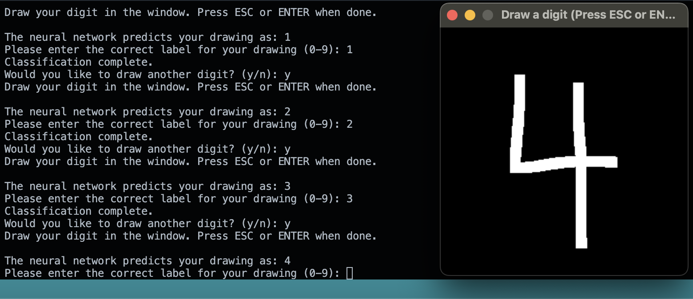

# MNIST classifier in C with Interactive Drawing 🤖🖼️🖋️ 

For instructions on how to run this program, scroll down to the bottom and find **Quick Run**. Now, for an in-depth explanation:

## Introduction

The universe is filled with patterns, and patterns can be described using mathematical functions. Neural networks are structures created from linking together a large amount of quite simple machines (neurons) and tuning their individual behavior based on the entire network's performance. Using pretty much just linear matrix operations, nonlinear activation functions, and gradient based learning, we can create a mathematical object that can learn patterns (by generating a function that could have potentially created that pattern, and therefore having the ability to generalize beyond the dataset it was given). I have demonstrated in a previous project (see `Scratchnn` and `ScratchnnV2` repositories) that even an extremely simple neural network can easily fit to a nonlinear boolean function (e.g. NOR or NAND), which makes them Turing Complete. In addition, there are rigorous proofs that discuss the "universal approximation theorems" - regarding the functions in which networks of varying depth or width can fit to - which conclude that a network of a hypothetical infinite depth could fit to absolutely any function. Deep neural nets are useful!

This project implements a neural network in C that recognizes handwritten digits from the MNIST dataset. Beyond just training on static data, the program allows users to interactively draw digits, classify them, and further train the network on these user-provided examples. Data from both the most recent batch, as well as any hand-drawn data that has been fed into the network can then be displayed as ASCII images. 

MNIST is almost entirely useless, except to demonstrate a simple NN's ability to see patterns and understand the "essence" of objects in order to classify them, in this case, handwritten digits. So, this was really done for learning purposes so that one day I can solve real-world problems. In addition, C can compile into Assembly, so this could be a low-power alternative to a python script that has all sorts of dependencies needed. 

***To be nice to the network, draw large digits in the center of the frame (legibility barely required near end of training). To see the obvious limitations of a model like this given its training data, draw digits in the corners of the frame.***

---

## Features

- **Dynamic Memory Allocation**: Utilizes `safe_malloc` for robust memory management.
- **Activation Functions**: Implements ReLU activation in hidden layers and softmax activation in the output layer.
- **Matrix Operations**: Manually performs forward and backward propagation using matrix operations.
- **Adaptive Learning Rate**: Adjusts the learning rate over epochs to enhance training efficiency.
- **Interactive Drawing**: Allows users to draw digits and integrates them into the training data.
- **Console Visualization**: Displays images in ASCII format directly in the console.
- **Data Loading**: Efficiently loads MNIST data from CSV files.
- **Model Persistence**: Includes functions to save and load the network state for future use.
- **Real-time User Interaction**: Handles user inputs during training without interrupting the training loop.

---

## Key Functions

- `init_network`: Initializes the neural network with a specified architecture.
- `forward_propagation`: Computes the output of the network for a given input.
- `backward_propagation`: Updates the network's weights and biases based on the error between predicted and target outputs.
- `adjust_learning_rate`: Dynamically adjusts the learning rate over epochs using a decay formula.
- `load_csv_data`: Loads images and labels from MNIST CSV files.
- `draw_digits_and_train`: Allows users to draw digits, classifies them, and optionally retrains the network.
- `handle_user_input`: Monitors and responds to real-time user commands during training.
- `display_images`: Displays recent batch images and hand-drawn images in the console.
- `save_network` and `load_network`: Save and load the neural network's state to and from a file.

---

## Network Architecture

1. **Input Layer**: 784 neurons (representing 28x28 pixel images).
2. **Hidden Layer 1**: 128 neurons (utilizing ReLU activation).
3. **Hidden Layer 2**: 64 neurons (utilizing ReLU activation).
4. **Output Layer**: 10 neurons (utilizing softmax activation for digits 0-9).

---

## Training Process

### 1. Initialization

- **Data Loading**: Load the MNIST training and test datasets from CSV files (`mnist_train.csv` and `mnist_test.csv`).
- **Network Setup**: Initialize the neural network with random weights and biases using the `init_network` function.

### 2. Training Loop

The training process iterates over a predefined number of epochs (e.g., 50 epochs).

#### Epoch Loop:

- **Shuffle Data**: Before each epoch, shuffle the training data to ensure randomness.
- **Batch Processing**: The training data is divided into batches (e.g., batch size of 200) for mini-batch gradient descent.

#### Batch Loop:

- **User Interaction Check**: Continuously check for user inputs without interrupting training:
  - `dr`: Enter drawing mode.
  - `di`: Display recent batch images and any hand-drawn images.
- **Forward Propagation**: Compute the network's predictions for the current batch using `forward_propagation`.
- **Loss Calculation**: Compute the cross-entropy loss between the predictions and the actual labels.
- **Backward Propagation**: Update the network's weights and biases using `backward_propagation`.
- **Accuracy Tracking**: Keep track of the accuracy and loss for each batch and epoch.
- **Learning Rate Adjustment**: Adjust the learning rate using the `adjust_learning_rate` function.

### 3. Epoch Summary

After each epoch, the program outputs:

- **Accuracy**: Percentage of correctly classified training examples.
- **Average Loss**: Mean loss over the epoch.
- **Learning Rate**: Current learning rate after adjustment.

### 4. Testing Phase

- After training, evaluate the network on the test dataset.
- Calculate and display the test accuracy.

### 5. Interactive Drawing

- **Drawing Mode**: Users can draw digits in a pop-up window using the mouse.
- **Classification**: The network predicts the drawn digit.
- **User Feedback**: Users can confirm or correct the predicted label.
- **Retraining**: The network can retrain on the user-drawn digit with an increased weight to improve recognition.

---

## Implementation of Mathematics

### Data Structures

1. **Weights**:
   - Stored as flattened 1D arrays representing 2D matrices.
   - Accessed using indices that correspond to the layers and neurons.
   - Shape: For layer `l`, the weights matrix has dimensions `(layer_sizes[l-1], layer_sizes[l])`.

2. **Biases**:
   - Stored as 1D arrays for each layer.
   - Shape: For layer `l`, biases vector has length `layer_sizes[l]`.

3. **Activations**:
   - Stored as 1D arrays for each layer.
   - Represents the output of neurons after applying the activation function.

4. **Z-values**:
   - Stores the weighted sums before activation.
   - Used in computing gradients during backpropagation.

### Forward Propagation

For each layer `l`:

1. Compute the weighted input `z`:

     

2. Apply the activation function:

   - **Hidden Layers**: Use ReLU activation.

     

   - **Output Layer**: Apply softmax to convert logits to probabilities.

     

### Activation Functions

- **ReLU (Rectified Linear Unit)**:

  

- **Softmax**:
  
  
  
  - Converts logits into probabilities that sum to 1.

### Backward Propagation

1. **Compute Output Layer Error**:

   

   - `y` is the one-hot encoded target vector.

2. **Backpropagate Error**:

   For each layer `l` from `L-1` down to `1`:

   

   - `\odot` denotes element-wise multiplication.

3. **Update Weights and Biases**:

   - **Weights**:

     

   - **Biases**:

     

   - `\eta` is the learning rate.

### Learning Rate Adjustment

- The learning rate is updated after each epoch using:

    

  - Ensures the learning rate does not fall below a minimum value.

### User Interaction Handling

- **Non-blocking Input**: The program uses non-blocking input to listen for user commands during training without pausing the training loop.
- **Drawing Mode**:
  - Utilizes SDL2 for graphical window management.
  - Captures user drawing input and processes it into a 28x28 pixel grayscale image.
  - Resizes and normalizes the image for input into the network.
- **Input Handling**:
  - The `handle_user_input` function checks for specific user commands and acts accordingly.
  - Saves and loads the network state to prevent disruption during interactive sessions.

---

## Future Improvements

- **Convolutional Neural Network (CNN)**: Incorporate convolutional layers to better capture spatial hierarchies in image data.
- **Batch Normalization**: Implement batch normalization to stabilize and accelerate training.
- **Dropout Regularization**: Add dropout layers to prevent overfitting.
- **Data Augmentation**: Enhance the training dataset with transformations (rotation, scaling) to improve generalization.
- **Enhanced GUI**: Develop a more user-friendly graphical interface for drawing and interaction.
- **Hyperparameter Optimization**: Implement automated hyperparameter tuning (e.g., learning rate, batch size).
- **Multi-threading**: Utilize parallel processing to speed up training on multi-core systems.
- **Error Handling**: Improve error checking and handling for file operations and user inputs.

---

## Quick Run

### Prerequisites

- **C Compiler**: Ensure you have GCC or another C compiler installed.
- **SDL2 Library**: Install SDL2 for handling the drawing window.
- **MNIST Dataset**: Download `mnist_train.csv` and `mnist_test.csv` and place them in the same directory as the source code.

### Compilation

Compile the program using the following command (super messy, I know, but this is what worked for me):

```bash
gcc -o mnistdraw mnistdraw.c -I/opt/homebrew/include $(sdl2-config --libs) -lm
```
- Adjust the include path (-I/opt/homebrew/include) based on your system.
- Ensure that sdl2-config is available in your PATH.

Execute the compiled program:
```bash
./mnistdraw
```

During Training:
- Draw a Digit: Type dr and press Enter to enter drawing mode.
- Display Images: Type di and press Enter to display recent batch images and any hand-drawn images.
  
Drawing Mode:
- A window will pop up where you can draw a digit using your mouse. Press Enter or Escape when you are done drawing. The program will predict your digit and ask you to confirm or correct it. Your drawing can be added to the training data and retrained upon.
This will also happen when training is fully complete, where the program will evaluate the network on the test dataset and display the accuracy before displaying a drawing window for you to test out the network's capabilties.



